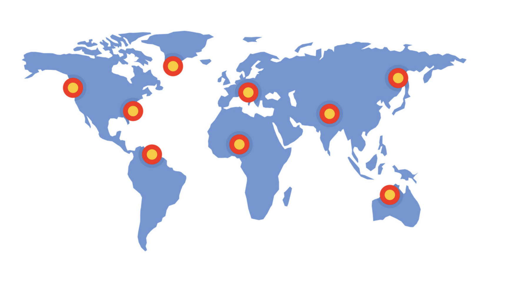
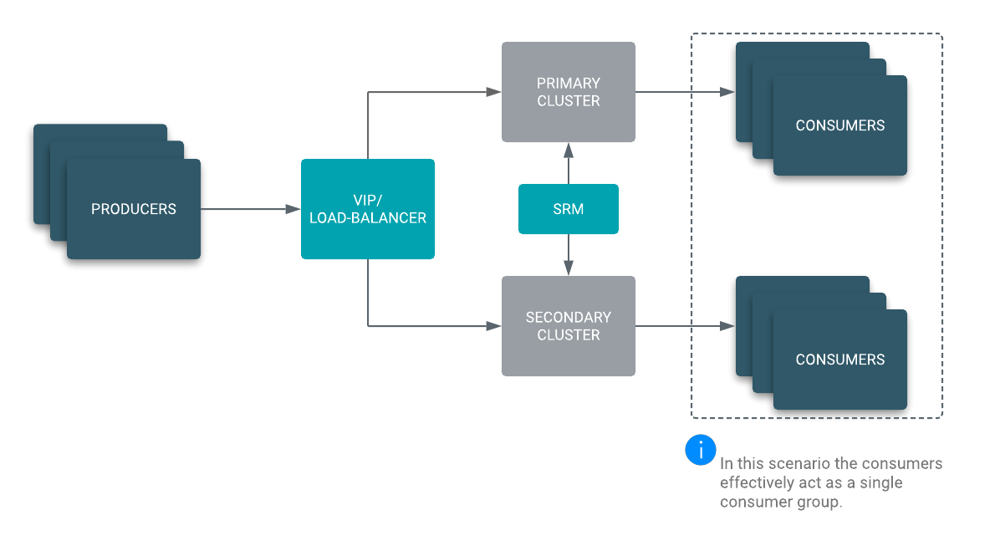
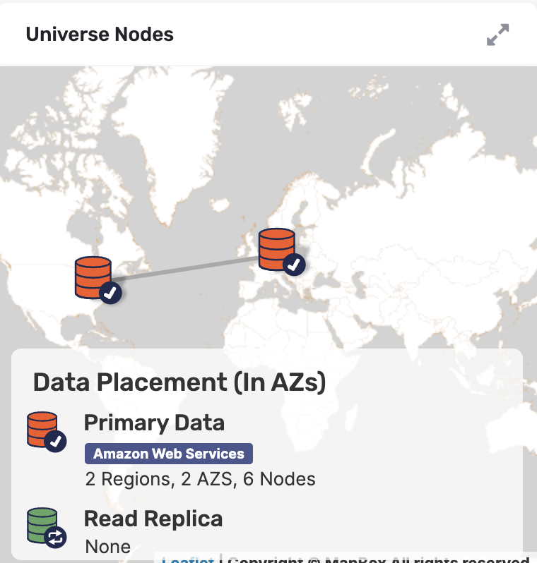

# How to examples to deploy multi-region Yugabyte Platform with Amazon Cloudformation

This post is an example of the techniques and examples of using AWS Cloudformation in automated deployment of multi-region Yugabyte clusters. Install process is complex and error prone if done by hand and/or combimation of scripts. Post highlights the advantages of YugabyteDB and the high level steps required in setting up the AWS infrastructures to support multi-region clusters. 

## Yugabyte

[Yugabyte Platform](https://yugabyteweb.wpengine.com/yugabytedb/) gives you the simplicity and support to deliver a private database-as-a-service (DBaaS) at scale. Use Yugabyte Platform to deploy YugabyteDB across any cloud anywhere in the world with a few clicks, simplify day 2 operations through automation, and get the services needed to realize business outcomes with the database. 

YugabyteDB on AWS is a powerful option and many customer want to run on AWS and have applications or recovery requirements that require multi-region deployments.

## Global Data Architectures need modern newSQL Database Features

Modern mission critical applications require 24/7 availability, rolling upgrades, low latency for reads and writes and span 2 or more continents. One of the key requirements for active-active architecture is RTO=0.  Acitve-Active architecure support writes to all regions concurrently and sync's data from each region to the other regions. Active-Passive solutions from current commercial vendors struggle and typical do not support Active-Acitve without the customer developing complex hardware and software additions. Even in these cases the actual RTO is still not 0. 

Diagram below is a conceptual Active-Active architecture. 

YugabyteDB is one of the only commercial vendors providing a true Active-Active architectuer using the YB strech architecure. one YB cluster can be deployed over 2 or more regions and even streched accross 2 or more cloud vendors in addition with on-prem support. 

To support 

**Compliance and Regulations**

Data security compliance won’t simply happen.  Every organization should have an explicit plan that outlines its compliance requirements and how to reach and maintain compliance with those regulations. In some cases, businesses can partner with third party data security platforms to help achieve and maintain data security compliance. Making data geo-location aware with the Yugabyte row level feature will help companys ease the process and burden of storing data with a defined political region. Multi-region clusters will allow companys to store compliant data in the region, data center and servers as required by common compliance laws GDPR, CCPA, CPRA, HIPAA, FISMA, SOX, PCI and many others. 

Making the nodes of a multi-region database cluster aware of the location characteristics of the data they store allows conforming to regulatory compliance requirements such as GDPR by keeping the appropriate subset of data local to different regions, and is arguably the most intuitive way to eliminate the high latency that would otherwise get incurred when performing operations on faraway, remote regions.(Karthik)

## Solution 

Yugabyte Multi-Region stretch clusters meet the requirements for global locationization of data with Yugabyte geo-location feature and Active Active data architecture the the Yugabyte Stretch Cluster Architecture.

## Steps to Deploy Multi-Region Cluster on AWS 

Follow is an outline of the steps required to first create the AWS infrastructures and the yugabyteDB steps

*need to fill all this in and align to Cloudformation scripts*

|      | 1. Create VPC                                               | Script ? |
| ---- | ----------------------------------------------------------- | -------- |
|      | 2. Create Internet Gateway                                  |          |
|      | 3. Attach the Internet Gateway to the VPC                   |          |
|      | 4. Create the Public Subnets                                |          |
|      | 5. Create Public Route Table                                |          |
|      | 6. Add Public Route to the Public Route Table               |          |
|      | 7. Associate the Public Subnets with the Public Route Table |          |
|      | 8. Create the Private Subnets                               |          |
|      | 9. Create the Security Groups                               |          |
|      | 10. Setup VPC peering between regions                       |          |

Deploying YB Platform is part of the Cloudformation EC2 build. The steps for the required tools and database are part of the EC2 build
